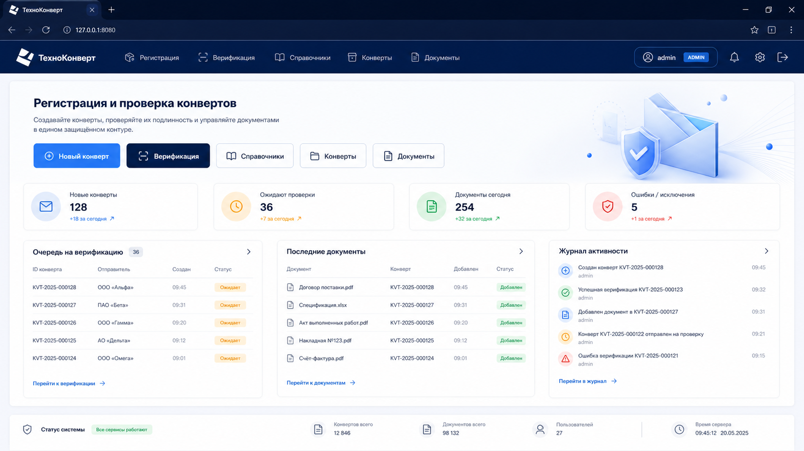

# Конверт-трек

Система учёта бухгалтерских документов, физически передаваемых между филиалами через курьеров.

Оператор сканирует документы в виртуальный **конверт**, запечатывает его, печатает бумажную опись и термоэтикетку. При получении сторона-получатель сканирует конверт и каждый документ, сверяясь с описью.

## Что уже реализовано

- Регистрация и верификация конвертов со сканером в keyboard-mode
- Интеграция с 1С OData (поиск документов, запись отметок, обработка конфликтов)
- Админ-панель: операторы, филиалы, подписанты, принтеры, аудит-лог, отметки в 1С
- Печать A4-описи и ZPL-этикеток
- Android TSD-клиент на Jetpack Compose

## Скриншоты

### Web: экран входа


### Web: рабочий экран



---

## Стек


| Слой    | Технология                                       |
| ------- | ------------------------------------------------ |
| Backend | Python 3.13 + FastAPI + SQLAlchemy 2 (async)     |
| БД      | PostgreSQL 16                                    |
| Web UI  | HTMX + vanilla JS, одна HTML-страница            |
| Печать  | Jinja2 → PDF (WeasyPrint); ZPL для термопринтера |
| Запуск  | uvicorn → nssm (Windows Service)                 |


---

## Быстрый старт (разработка)

### 1. База данных

Запустить PostgreSQL в Docker:

```bash
docker run -d --name pg-konvert \
  -e POSTGRES_USER=convert_track \
  -e POSTGRES_PASSWORD=convert_track \
  -p 5433:5432 \
  postgres:16-alpine

# Создать тестовую БД отдельно
docker exec -it pg-konvert psql -U convert_track \
  -c "CREATE DATABASE convert_track_test;"
```

Либо через compose (поднимает обе БД сразу):

```bash
docker compose up -d
```

### 2. Python окружение

```bash
python -m venv venv
venv\Scripts\python -m pip install -e .[dev]
venv\Scripts\python -m playwright install chromium
```

Или одним шагом (создание venv + зависимости + браузер Playwright):

```powershell
powershell -ExecutionPolicy Bypass -File .\scripts\bootstrap-venv.ps1 -Dev
```

### 3. Переменные окружения

Скопируйте `.env.example` → `.env` и заполните реальные значения:

```bash
copy .env.example .env
```

Обязательные ключи:


| Ключ                    | Описание                                              |
| ----------------------- | ----------------------------------------------------- |
| `DATABASE_URL`          | asyncpg-строка подключения к рабочей БД               |
| `DATABASE_URL_TEST`     | asyncpg-строка подключения к тестовой БД              |
| `ADMIN_TOKEN`           | Секретный токен для `X-Admin-Token` (эндпоинт сброса) |
| `ODATA_BASE_URL`        | Корень OData-сервиса 1С (`…/odata/standard.odata`)    |
| `ODATA_ADMIN_USER`      | Логин технической учётной записи 1С                   |
| `ODATA_PASSWORD`        | Пароль технической учётной записи 1С                  |
| `ODATA_TIMEOUT_SECONDS` | Таймаут запросов к 1С (по умолчанию 60)               |


### 4. Миграции

```bash
venv\Scripts\alembic upgrade head
```

### 5. Запуск сервера

```bash
venv\Scripts\uvicorn app.main:app --host 127.0.0.1 --port 8080 --reload
```

Откройте браузер: **[http://127.0.0.1:8080/](http://127.0.0.1:8080/)**

---

## Тестирование

```bash
# Все тесты
venv\Scripts\python -m pytest

# Один файл
venv\Scripts\python -m pytest tests/test_api_envelopes.py -x -v

# Один тест
venv\Scripts\python -m pytest tests/test_api_envelopes.py::test_seal_happy -x
```

Тесты используют реальную PostgreSQL (`DATABASE_URL_TEST`). Каждый тест запускается с чистыми таблицами (TRUNCATE перед тестом).

---

## Структура проекта

```
app/
├── config.py              # Настройки через pydantic-settings
├── db.py                  # Async engine + session factory
├── deps.py                # FastAPI dependency providers
├── exceptions.py          # AppError + обработчик
├── main.py                # FastAPI app, lifespan, роутеры
├── models/                # SQLAlchemy ORM модели
│   ├── envelope.py
│   ├── envelope_document.py
│   ├── branch.py
│   ├── signer.py
│   └── audit_log.py
├── services/              # Бизнес-логика
│   ├── envelopes.py       # Создание, добавление/удаление доков, запечатывание
│   ├── verify.py          # Старт, сканирование, завершение верификации
│   ├── dictionaries.py    # CRUD филиалов и подписантов
│   ├── barcodes.py        # Конвертация ШК ↔ GUID, генератор номера конверта
│   ├── audit.py           # Запись событий в журнал
│   └── odata.py           # HTTP-клиент 1С OData
├── routers/
│   ├── api/               # REST API (/api/...)
│   │   ├── envelopes.py
│   │   ├── dictionaries.py
│   │   ├── verify.py
│   │   └── admin.py
│   └── ui/                # HTMX-фрагменты (/ui/..., /)
│       └── pages.py
└── web/
    ├── static/            # CSS, JS, шрифты, иконка
    └── templates/         # Jinja2 шаблоны
        ├── base.html
        ├── index.html
        └── partials/      # HTMX-фрагменты (подставляются в страницу)
alembic/                   # Миграции
tests/                     # pytest тесты
docker-compose.yml         # PostgreSQL для разработки
```

---

## API (краткий справочник)

### Конверты


| Метод    | URL                                      | Описание                                       |
| -------- | ---------------------------------------- | ---------------------------------------------- |
| `POST`   | `/api/envelopes`                         | Создать черновик конверта                      |
| `GET`    | `/api/envelopes/{id}`                    | Получить конверт по UUID                       |
| `GET`    | `/api/envelopes/by-barcode/{bc}`         | Найти конверт по ШК                            |
| `POST`   | `/api/envelopes/{id}/documents`          | Добавить документ (тело: `{"barcode": "..."}`) |
| `DELETE` | `/api/envelopes/{id}/documents/{doc_id}` | Удалить документ                               |
| `POST`   | `/api/envelopes/{id}/seal`               | Запечатать конверт                             |


### Верификация


| Метод  | URL                                 | Описание                                  |
| ------ | ----------------------------------- | ----------------------------------------- |
| `POST` | `/api/envelopes/{id}/verify/start`  | Начать верификацию                        |
| `POST` | `/api/envelopes/{id}/verify/scan`   | Отсканировать документ                    |
| `POST` | `/api/envelopes/{id}/verify/finish` | Завершить (`force=true` — с расхождением) |


### Справочники


| Метод      | URL                  | Описание                    |
| ---------- | -------------------- | --------------------------- |
| `GET/POST` | `/api/branches`      | Список / создать филиал     |
| `PATCH`    | `/api/branches/{id}` | Изменить филиал             |
| `GET/POST` | `/api/signers`       | Список / создать подписанта |
| `PATCH`    | `/api/signers/{id}`  | Изменить подписанта         |


### Служебные


| Метод  | URL                | Описание                                         |
| ------ | ------------------ | ------------------------------------------------ |
| `GET`  | `/api/health`      | Проверка состояния сервиса                       |
| `POST` | `/api/admin/reset` | Очистить все данные (только `ENV != production`) |


**Аутентификация:** оператор передаётся cookie `operator_name`; администратор — заголовком `X-Admin-Token`.

---

## Статусная машина конверта

```
draft → sealed → verified
                ↘ verified_with_discrepancy
```

- `draft` — список документов можно редактировать
- `sealed` — список заморожен, доступна печать
- `verified` / `verified_with_discrepancy` — финальные состояния после верификации

---

## Алгоритмы

### ШК документа → GUID 1С

```python
import uuid
def barcode_to_guid(barcode: str) -> str:
    return str(uuid.UUID(bytes=int(barcode).to_bytes(16, "big")))
```

ШК должен быть строкой из 16+ цифр, вмещающейся в 16 байт. Иначе — ошибка `barcode_invalid`.

### Поиск документа в 1С (OData)

Перебираем типы документов по порядку до первого 200-ответа:

1. `Document_ПеремещениеТоваров`
2. `Document_СчетФактураВыданный`

Полный payload 1С сохраняется в `envelope_documents.raw_1c_payload` (jsonb).

---

## Производственный запуск (Windows Server + nssm)

```bash
nssm install ConvertTrack "E:\technodt\venv\Scripts\python.exe" "-m uvicorn app.main:app --host 127.0.0.1 --port 8080"
nssm set ConvertTrack AppDirectory E:\technodt
nssm set ConvertTrack AppEnvironmentExtra ENV=production
nssm start ConvertTrack
```

Apache (уже стоит для 1С) — при необходимости внешнего доступа добавить `mod_proxy` на `127.0.0.1:8080`. Конфиг Apache для 1С не трогать.

---

## Android Release APK

Готовый релизный APK хранится в репозитории:

- `releases/konvert-track-v1.4.0-release.apk`

Сборка выполняется командой:

```powershell
cd android
.\gradlew.bat assembleRelease
```

---

## Разработка

```bash
# Линтер
venv\Scripts\python -m ruff check app/ tests/

# Автоформат
venv\Scripts\python -m ruff format app/ tests/

# Новая миграция (после изменения models/)
venv\Scripts\alembic revision --autogenerate -m "describe change"
venv\Scripts\alembic upgrade head
```

